```mermaid
graph TD
  M0["GenBall/BattleSystem<br/>117 files, 110 classes"]
  M1["GenBall/Entry<br/>2 files, 2 classes"]
  M2["GenBall/Event<br/>16 files, 10 classes"]
  M3["GenBall/Framework<br/>10 files, 7 classes"]
  M4["GenBall/Player<br/>27 files, 10 classes"]
  M5["GenBall/Procedure<br/>24 files, 12 classes"]
  M6["GenBall/Utils<br/>16 files, 16 classes"]
  M7["Yueyn/Base<br/>9 files, 11 classes"]
  M8["Yueyn/Event<br/>4 files, 4 classes"]
  M9["Yueyn/Fsm<br/>5 files, 6 classes"]
  M10["Yueyn/Main<br/>12 files, 11 classes"]
  M11["Yueyn/ObjectPool<br/>7 files, 4 classes"]
  M12["Yueyn/Pool<br/>3 files, 1 classes"]
  M13["Yueyn/Resource<br/>6 files, 6 classes"]
  M14["Yueyn/Timer<br/>3 files, 1 classes"]
  M15["Yueyn/UI<br/>11 files, 13 classes"]
  M16["Yueyn/Utils<br/>9 files, 7 classes"]
  M9 -->|"2"| M7
  M12 -->|"1"| M11
  M3 -->|"1"| M2
  M4 -->|"1"| M0
  M4 -->|"1"| M1
```

### GenBall/BattleSystem
| Class | Summary |
|---|---|
| **BulletDamageUpBuff** | 子弹伤害提升Buff，继承BuffObj，添加时获取武器的WeaponState并增加Damage倍率增益，移除时撤销。 |
| **BuffModelConfig** | Buff模型配置管理类，通过ScriptableObject列表加载Buff数据，维护BuffId→BuffModel字典和BuffType缓存，支持反射类型解析。 |
| **BuffModel** | Buff数据模型，包含BuffId、BuffType、DisplayName、优先级、多实例标志、标签、参数字典和最大叠层数等完整Buff配置字段。 |
| **BuffObj** | Buff对象基类，管理Buff完整生命周期：通过AddBuffInfo创建实例、Tick计时更新、OnAdd/OnStack/OnUnstack/OnRemove回调，支持对象池回收。 |
| **BuffRegistry** | 全局Buff注册中心，实现IBuffRegistry接口，管理所有活跃Buff列表，AddBuff处理叠层逻辑并触发BeforeAdd/AfterAdd/BeforeStack/AfterStack事 |
| **AddBuffInfo** | Buff添加信息结构体，封装创建Buff所需的全部上下文：Model/BuffId、Caster/Carrier引用、追加叠层数和自定义参数字典，支持对象池。 |
| **BuffTickSystem** | Buff Tick系统，实现ILogicUpdate和IBuffTickSystem，Init订阅6个全局事件（伤害/死亡相关），LogicUpdate遍历活跃Buff执行Tick，事件处理器触发对应 |
| **IBuff** | Buff核心接口，定义Priority（优先级）、CanMultiExist（是否允许多实例）、Tags（标签集合）三个基础属性。所有Buff和触发器接口均派生自此。 |
| **DefaultComparerBuff** | Buff默认比较器，实现IComparer<IBuff>，按Priority升序排列，用于Buff容器的排序集合。 |
| **IBuffContainer** | Buff容器核心接口，定义AddBuff/RemoveBuff方法和Buffs可枚举属性，所有可承载Buff的实体（角色、武器等）实现此接口。 |
| **BuffContainerExtensions** | Buff容器扩展方法类，提供泛型过滤查询（GetBuffs<T>）、BuffId过滤查询和列表对象池（BuffListPool）管理，简化Buff检索和内存分配。 |
| **ArmorBuff** | 玩家护甲Buff，继承BuffObj并实现ITriggerBeforeTakeDamage。护甲值随MaxHealth联动，伤害先扣护甲再穿透至生命，提供Armor变化事件通知UI更新。 |
| **ICommand** | 命令标记接口，所有角色命令（MoveCommand、RotateCommand、FaceDirectionCommand等）的统一类型标识，用于CommandDispatcher路由。 |
| **AttackCommand** | 攻击命令结构体，实现IArbitratedCommand（默认优先级2/2），携带AttackId和ButtonState，可缓冲，阻止移动但不阻止旋转和重力。 |
| **DashCommand** | 冲刺命令结构体，实现IArbitratedCommand（高优先级5/5），携带方向和速度，不可缓冲，阻止移动、旋转和重力。 |
| **AbilitySecondaryCommand** | 技能副键命令结构体，实现IArbitratedCommand（默认优先级2/2），传递ButtonState，可缓冲，不阻止移动/旋转/重力。 |
| **IArbitratedCommand** | 可仲裁命令接口，定义命令优先级仲裁体系的核心属性：中断优先级/反中断优先级/可缓冲标志，以及是否阻止移动/旋转/重力的行为屏蔽标志。 |
| **InteractCommand** | 交互命令结构体，实现IArbitratedCommand（低优先级0/0），携带InteractAction（Trigger/Next/Previous），不可缓冲，阻止移动。瞬时指令按一次触发一次。 |
| **IBuffRegistry** | 全局Buff注册中心接口契约，定义ActiveBuffs可枚举属性和AddBuff/RemoveBuff方法，由BuffRegistry实现。 |
| **IBuffTickSystem** | Buff Tick系统标记接口，继承ISystem，标识Buff tick更新系统的类型契约。 |
| ... | +90 more classes |

### GenBall/Entry
| Class | Summary |
|---|---|
| **GameEntry** | 游戏入口单例类，在 Awake 中创建 Entry 并注册所有模块（RegisterModules），在 Start 中初始化 Entry，驱动 Update/FixedUpdate 主循环。 |
| **GameEntry** | GameEntry 的 partial 扩展，通过 RegisterModules 扫描 IComponent 子组件并注册到 Entry，暴露 Event、UI、Save、Fsm、Timeline  |

### GenBall/Event
| Class | Summary |
|---|---|
| **EventEntry** | 事件条目数据类，存储 eventId 和 parameters 序列化引用，在 EventAdapter.Entries 中使用。 |
| **EventAdapter** | 事件适配器 MonoBehaviour，支持多事件入口配置（Entries），通过 EnsureMigrated 将旧版 eventId/parameters 迁移至 Entries 列表，Fire  |
| **IEventParameter** | 事件参数接口，定义 Dispatch 方法契约，用于将参数值分发到具体的事件处理逻辑。 |
| **EventParameterBase** | 事件参数泛型基类，实现 IEventParameter，提供空的 Dispatch 虚方法供具体参数类型重写。 |
| **EventParamHintAttribute** | 自定义 PropertyAttribute，存储 EventId 用于 Inspector 中的事件参数提示和 PropertyDrawer 渲染。 |
| **ILocalEventManager** | 本地事件管理器接口，定义实体级事件的订阅/取消订阅和队列触发/立即触发方法。 |
| **PlacedEventTable** | 关卡放置事件表ScriptableObject，持有PlacedEventEntry列表并实现ValidateNoConflicts验证逻辑确保事件ID无冲突。 |
| **RuntimeEventTrigger** | 运行时事件触发器MonoBehaviour，支持Collision/Interact/EventListener三种触发模式，管理触发冷却、最大次数和事件参数反序列化。 |
| **ValueEventDefinition** | 值事件定义的可序列化Schema，包含事件名称、值类型、描述、模块归属等元数据，自动计算FullName、TypeFullName、TypeName和TypeNamespace等派生属性。 |
| **ValueChangeEventArgs** | 泛型值变化事件参数类，继承BaseEventArgs，通过ReferencePool对象池管理生命周期，使用TypeNamePair生成哈希事件ID以支持不同类型的值变化通知。 |

### GenBall/Framework
| Class | Summary |
|---|---|
| **AppConfigManager** | 应用配置管理器，实现IConfigProvider接口，通过Dictionary管理所有配置的加载/缓存/查询，Init时集中加载六大类配置。 |
| **AppSettingsConfig** | 应用全局设置的ScriptableObject，定义最大存档数、启动场景名、运行模式、场景加载配置和默认玩家生成点等核心启动参数。 |
| **BulletConfigCollection** | 子弹配置集合ScriptableObject，Init时将配置列表转为Dictionary，提供Get和TryGet基于BulletId的O(1)查询。 |
| **BulletConfigEntry** | 单个子弹配置条目，定义ID、检测模式、视觉预制体、存活时间、命中行为和移动修改器等完整子弹参数。 |
| **EntityUpdateSystem** | 实体更新调度系统，实现IEntityUpdateSystem/IFrameUpdate/ILogicUpdate，通过SafeIterableList分别管理帧更新和逻辑更新两组实体列表。 |
| **FrameworkDefault** | 框架初始化默认实现，在DoInit中以显式构造注入模式注册全部20+个ISystem服务到SystemRepository，是项目的依赖注入配置中心和启动入口。 |
| **TimeScaleSystemDefault** | 时间缩放系统默认实现，实现ITimeScaleSystem接口，管理多个时间缩放请求并按优先级计算最终EffectiveScale。 |

### GenBall/Player
| Class | Summary |
|---|---|
| **PlayerCameraInitializer** | 玩家相机初始化器，将主相机绑定到角色Transform并设置渲染层，包含SetCamera私有方法和Initialize公开入口。 |
| **PlayerUiInitializer** | 玩家UI初始化器，在角色初始化时绑定健康/护甲/Buff数据到UI事件系统，提供Initialize、UpdateHealth、UpdateMaxHealth、UpdateArmor四个方法。 |
| **InputController** | 接收 Unity Input Action 绑定回调，将输入上下文转换为 InputEventArgs 并通过 EventManager 派发。 |
| **InputEventArgs<T>** | 泛型输入事件参数类，包含 Id、Name 和泛型 Args 属性，实现 IReference 用于对象池复用。 |
| **InputEventArgs** | 非泛型输入事件参数类，仅包含 Id 和 Name，用于无额外数据的事件派发。 |
| **InputHandler** | 集中管理玩家所有输入按键的当前状态（移动方向、视角增量、跳跃/冲刺/射击等按键），在 FixedUpdate 中处理视角输入并通过事件回调通知外部。 |
| **Player** | 玩家实体主类，通过 partial 分散在多个文件中，聚合了控制、生命值、武器、物理、FSM 状态机等子系统。 |
| **PlayerDashState** | 玩家冲刺 FSM 状态，管理冲刺方向、速度、无敌时间和持续时间，支持状态转换回移动/跳跃。 |
| **PlayerJumpState** | 玩家跳跃 FSM 状态，通过观察 FSM 变量实现短按/长按跳跃高度控制、土狼时间（离地后短暂可跳跃）、输入缓冲和空中冲刺切换。 |
| **PlayerMoveState** | 玩家地面移动 FSM 状态，通过观察 OnGround/DashInput/JumpInput 变量实现响应式状态转换。 |

### GenBall/Procedure
| Class | Summary |
|---|---|
| **SceneInitContext** | 场景初始化上下文数据结构，包含玩家生成位置和旋转。 |
| **LoadSceneState** | 加载场景状态，负责启动流程中最复杂的阶段：从配置系统获取场景配置，初始化地图模型，订阅场景加载完成事件，并触发场景执行器。 |
| **LaunchSystemDefault** | ILaunchSystem 的默认实现，维护 SimpleFsm 状态机，通过配置获取运行模式和起始场景，在帧更新中驱动状态流转并触发全局事件。 |
| **SceneExecutorSystemDefault** | ISceneExecutorSystem 的默认实现，协调场景初始化后的所有运行时生成工作，包括玩家创建、篝火/触发器/敌人生成，以及场景事件编排器注册。 |
| **SceneLoadSystemDefault** | ISceneLoadSystem 的默认实现，管理 Unity 异步场景加载操作，在帧更新中追踪进度、检测加载完成并触发事件通知。 |
| **GameManager** | IGameManagerSystem 的实现类，维护 ISaveDataProvider 字典，协调游戏数据的收集、存储与恢复，通过 ISaveService 进行持久化操作。 |
| **GameStartSystemDefault** | IGameStartSystem 的默认实现，根据 GameStartRequest 的类型分发到新游戏/继续/加载流程，负责构建启动上下文并设置提供者默认值。 |
| **PauseManager** | IPauseSystem 的实现类，使用 Stack 管理多层暂停请求，Push/Pop 时通过 SystemUpdaterManager.Instance.SetPause 控制逻辑/物理更新，并通 |
| **GameData** | 可序列化的游戏数据容器类，内部使用 DataBlock 列表存储键值对，提供 GetData/SetData/HasData 方法，记录创建时间和最后更新时间等时间戳。 |
| **SaveComponent** | IComponent 和 ISaveService 的旧框架实现，维护存档槽缓存映射，提供 SaveGameData/LoadGameData/CreateNewSave/DeleteSave 等完整 |
| **SaveSystem** | ISystem 和 ISaveService 的新框架实现，通过 SystemRepository 获取配置依赖，提供完整的存档槽和存档文件的 CRUD 操作与 JSON 持久化。 |
| **UserSettingsStorage** | IUserSettingsStorage 的实现类，负责用户设置的加载、保存和应用，通过 PersistentDataPath 确定文件路径，支持同步加载和异步写入。 |

### GenBall/Utils
| Class | Summary |
|---|---|
| **LiveDataAttribute** | System.Attribute 子类，为 LiveData 代码生成器提供元数据配置。 |
| **UiBindingConfig** | UI 绑定配置的主配置类，包含前缀映射表、基类名称、命名空间和输出路径等全局配置。 |
| **PrefixMapping** | 单个前缀映射数据类，记录 GameObject 命名前缀到具体 UI 组件类型（Button/Text 等）的映射关系。 |
| **UiBindTool** | UI 绑定工具类，维护四类映射表（Text/Image/Button/RectTransform），提供按名称查询和批量设置/清空绑定数据。 |
| **UiViewBinding** | ScriptableObject 子类，存储视图类型、表单名称、表单类型、命名空间和输出路径等代码生成元数据。 |
| **CountdownController** | CountdownController 的分部类声明，包含内部私有类 CountdownEvent 的定义。 |
| **CountdownEvent** | CountdownController 内部的倒计时事件类，实现 IReference 支持引用池复用，管理倒计时状态（暂停/触发）并通过回调通知。 |
| **CountdownController** | 倒计时控制器主分部类，维护命名倒计时事件字典，提供完整的 CRUD 操作和帧更新调度。 |
| **BakingPipeline** | 静态编辑器工具类，从场景收集 IScenePlaceable 并按 SavePoint/EnemySpawn/Trigger/Mechanism 分类写入 ScriptableObject 配置。 |
| **MapSceneEditorWindow** | 继承 EditorWindow 的地图场景编辑器，管理 IScenePlaceable 对象列表、分类分组、选中编辑和场景设置。 |
| **PlaceableContextMenu** | 静态编辑器工具类，通过 MenuItem 特性注册右键菜单创建入口，提供动态（解包）和静态（保留 Prefab 链接）两种创建路径。 |
| **PlaceableSceneGUI** | 静态编辑器工具类，提供 DrawGizmo 绘制场景可视化（球体/连线/标签）和 DrawPositionHandle 位置编辑手柄。 |
| **PlaceableTypeDiscovery** | 静态反射工具类，包含内部数据类 PlaceableTypeInfo，通过 DiscoverAll 扫描全域类型并按类别排序返回。 |
| **SavePointReferenceDrawer** | 继承 PropertyDrawer，将 SavePointReference 属性渲染为下拉框，从 SceneConfigCollection 加载存档点列表，提供定位按钮。 |
| **SingletonManager** | 静态单例管理类，维护 ISingleton 实例字典，通过泛型 GetSingleton 方法实现惰性初始化（lazy initialization）的工厂模式。 |
| **TriggerObject** | 继承 MonoBehaviour 的触发器组件，监听 OnTriggerEnter/Stay/Exit 三个 Unity 物理事件，通过 targetLayerMask 过滤碰撞层后调用对应的 Uni |

### Yueyn/Base
| Class | Summary |
|---|---|
| **BaseEventArgs** | 事件参数抽象基类，实现 IReference 接口，包含事件 ID 属性和将 ID 重置为默认值的 Clear 方法，供所有具体事件参数类继承。 |
| **EventPool** | GameFramework 事件池泛型类，管理 EventHandler 的双向链表缓存，提供 Check/Subscribe/Unsubscribe 订阅管理和 Fire（入队）/FireNow（立 |
| **EventPool** | EventPool 的分部类声明，包含内部私有 Event 类的定义，该 Event 类封装发送者和事件参数并支持引用池复用。 |
| **Event** | EventPool 内部的私有事件数据类，实现 IReference 接口，存储事件发送者和泛型事件参数，通过 ReferencePool.Acquire 工厂方法创建并支持池化复用。 |
| **ReferencePool** | 静态引用池类，维护类型到 InternalPool 的字典映射，对外暴露泛型和非泛型两套 Acquire/Release/Add/Remove/RemoveAll 接口，通过 IsValidPoolT |
| **ReferencePool** | ReferencePool 的分部类声明，包含内部私有 InternalPool 类的完整定义和实现。 |
| **InternalPool** | 单个引用类型的内部对象池，使用 Queue<IReference> 管理空闲对象，通过 lock 保证线程安全，维护使用计数，支持泛型和非泛型 Acquire/Add/Remove/RemoveAll |
| **Variable** | 泛型响应式变量类，维护观察者委托列表，提供 Observe/Unobserve 订阅管理、GetValue/SetValue 读写和 PostValue 通知所有观察者的发布模式，支持 Referen |
| **LiveDelegate** | 泛型委托变量类，通过 SetDelegate 绑定一个返回当前值的委托，GetValue 调用委托实时计算值，SetValue 仅校验非空但不存储，适用于动态计算型变量。 |
| **Variable** | 变量抽象基类，实现 IReference 接口，声明 Type 属性和 GetValue/SetValue/Clear 三个抽象方法，为 Variable<T> 和 LiveDelegate<TDel |
| **IReference** | 引用池对象的抽象接口，定义了 Clear 方法用于回收时重置对象状态。 |

### Yueyn/Event
| Class | Summary |
|---|---|
| **CEventRouter** | 全局事件路由 Singleton，封装 EventDispatcher 为项目提供统一的事件发布订阅总线。 |
| **EventDispatcher** | 核心事件分发引擎，内部维护订阅字典和待处理事件队列，支持 Fire 延迟分发和 FireNow 立即分发。 |
| **EventManager** | 旧框架事件管理器组件，实现 IComponent 接口，通过 Entry 调度 EventPool 的 Update/Shutdown。 |
| **GameEventArgs** | 游戏事件参数的抽象基类，所有具体游戏事件参数类型通过继承此类获得统一标识。 |

### Yueyn/Fsm
| Class | Summary |
|---|---|
| **Fsm** | 泛型有限状态机，管理状态字典、当前状态切换、变量数据存储和帧更新，通过 ReferencePool 池化。 |
| **FsmManager** | 旧框架状态机管理器组件，通过 Dictionary 管理多个 FSM 实例，提供创建/获取/销毁 API 和统一帧更新。 |
| **FsmState** | FSM 状态的抽象基类，提供完整的生命周期虚方法（初始化/进入/退出/更新/销毁）供具体状态覆写。 |
| **IFsm** | FSM 的非泛型接口，暴露 OwnerType/Name/IsRunning 等属性和 Update/Shutdown 方法。 |
| **SimpleFsm** | 简化的有限状态机，使用枚举状态类型和 SimpleFsmState 进行状态管理，适用于轻量级场景。 |
| **SimpleFsmState** | 简化 FSM 状态的抽象基类，定义 OnEnter/OnUpdate/OnExit 三个生命周期虚方法。 |

### Yueyn/Main
| Class | Summary |
|---|---|
| **SystemUpdater** | 系统更新调度器，维护 Framework 和 Game 两组三级队列（Logic/Frame/LateFrame），提供注册/注销和批量更新驱动，使用 SafeIterableList 保障遍历安全。 |
| **SystemUpdaterManager** | 系统更新管理器，持有两个 SystemUpdater 实例，根据系统 Scope 自动路由注册到对应队列，支持暂停和恢复控制。 |
| **Entry** | 旧框架组件容器入口，负责 IComponent 的注册/初始化/优先级排序/帧更新调度和注销管理。 |
| **FrameworkBase** | 框架唯一 MonoBehaviour，DontDestroyOnLoad，在 Awake 中初始化资源助手和系统仓库，Update/FixedUpdate/LateUpdate 驱动框架循环。 |
| **IComponent** | 旧框架组件接口（已废弃），定义 Entry 托管组件的标准生命周期和优先级排序。 |
| **IFrameUpdate** | 帧更新接口，ISystem 可选实现以接收每帧的 FrameUpdate 调用和指定的更新作用域。 |
| **ILateFrameUpdate** | 延迟帧更新接口，ISystem 可选实现以接收 LateFrameUpdate 调用。 |
| **ILogicUpdate** | 逻辑更新接口，ISystem 可选实现以在 FixedUpdate 中接收固定帧间隔的逻辑更新。 |
| **ISystem** | 新框架最小系统接口，作为 IoC 容器中所有业务系统的基类型，定义 Init 和 UnInit 生命周期。 |
| **ITimeScaleSystem** | 时间缩放系统接口，提供 Request/ReleaseRequest 方法和 EffectiveScale 属性用于多源时间缩放管理。 |
| **SystemRepository** | IoC 容器单例，管理 ISystem 实例的注册/查询/注销，自动处理生命周期回调并注册到 SystemUpdaterManager。 |

### Yueyn/ObjectPool
| Class | Summary |
|---|---|
| **IObjectPool<T>** | 泛型对象池接口，定义 Spawn/Despawn/Register/Release 等核心操作，支持配置容量、过期时间、优先级和自动释放间隔。 |
| **ObjectBase** | 对象池托管对象的基类，封装 Target/Locked/Priority/LastUsedTime 状态，提供 Initialize/Clear/OnSpawn/OnDespawn/Release 生 |
| **ObjectPoolBase** | 对象池抽象基类，定义 Name/Priority/ObjectType/Count 等核心属性和 Release/Update/Shutdown 方法的抽象契约。 |
| **ObjectPoolManager** | 老旧对象池管理器（IComponent），通过字典维护所有 ObjectPool<T> 实例，提供丰富的 CreateSingleSpawn/CreateMultiSpawn 重载和生命周期管理。 |

### Yueyn/Pool
| Class | Summary |
|---|---|
| **CPoolManager** | 新一代对象池管理器（Singleton），提供与 ObjectPoolManager 相同的 API 风格但采用 Singleton 模式，是 GameObject 对象池的主要入口。 |

### Yueyn/Resource
| Class | Summary |
|---|---|
| **AssetBundleLoader** | AssetBundle 底层加载器，通过 AssetBundleManifest 管理依赖关系图，支持同步/异步加载、引用计数和批量卸载。 |
| **CResourceManager** | 统一资源管理器（Singleton），通过 IResourceHelper 策略接口委托实际加载，支持 Load/LoadSync/Unload 操作。 |
| **IResourceHelper** | 资源加载策略接口，定义 Load/LoadSync/Unload 方法签名，支持 Editor 和 AssetBundle 两种运行时实现。 |
| **ResourceHelperAssetBundle** | IResourceHelper 的 AssetBundle 实现，封装 AssetBundleLoader，提供协程异步加载、路径解析和平台适配。 |
| **ResourceHelperEditor** | IResourceHelper 的 Editor 实现，直接使用 AssetDatabase API 加载资源，跳过 AssetBundle 构建流程以加速开发。 |
| **ResourceManager** | 老旧资源管理器（IComponent），提供 LoadPrefab 方法和标准 IComponent 生命周期，已逐步被 CResourceManager 替代。 |

### Yueyn/Timer
| Class | Summary |
|---|---|
| **Timer** | 定时器系统，维护 ActiveEvents 和 PausedEvents 字典，支持按名称订阅倒计时、暂停/恢复/重置/手动触发，通过 ReferencePool 管理 Event 对象复用。 |
